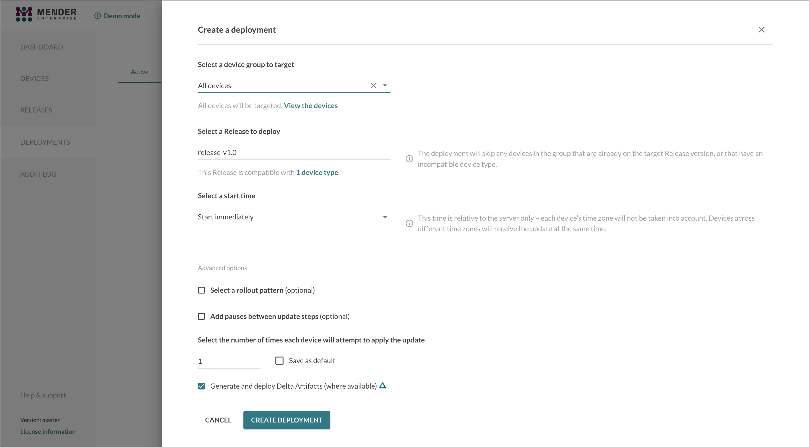
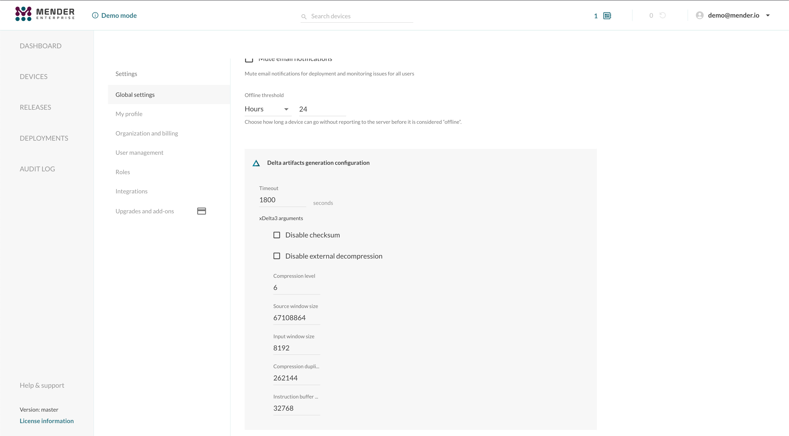

Mender Enterprise supports the server-side generation of Delta Artifacts.
This document explains the prerequisites to enable this feature and how it works.

!!! Hosted Mender supports this feature in the Enterprise plan; however, its availability requires a tenant-specific activation.
!!! If you are a customer interested in it, please get in touch with the [Hosted Mender support team](mailto:support@mender.io).

### Prerequisites

To support the server-side generation of Delta Artifacts, your device must report the availability of the `mender-binary-delta` Update Module to the server.
This will happen automatically if you are building your firmware using Yocto and the `meta-mender` layer.
Otherwise, create and install your own bootstrap Artifact to provide these keys:

```bash
mender-artifact write bootstrap-artifact \
    --artifact-name mender-binary-delta-provide-keys \
    --device-type <dev-type> \
    --provides "rootfs-image.update-module.mender-binary-delta.mender_update_module:mender-binary-delta" \
    --provides "rootfs-image.update-module.mender-binary-delta.version:<version>" \
    --output-path mender-binary-delta-provide-keys.mender
```

The Artifact can be installed in standalone mode or remotely deployed with the Mender server.

<!--AUTOVERSION: "mender-artifact/blob/%"/ignore-->
Additionally, to make the server-side generation of Delta Artifacts possible, the Mender Artifact of the current version of the [`rootfs-image`](https://github.com/mendersoftware/mender-artifact/blob/3.9.0/Documentation/artifact-format-v3.md#header-info) running on your device and the updated one must be available as Artifact on the Mender Server.


### Enabling the server-side generation of Delta Artifacts

You can enable this feature by selecting the option "Generate and deploy Delta Artifacts (where available)" when you create a deployment for your devices. This option will enable the server-side generation of Delta Artifacts when turned on.



When you target a device running the Mender Client and the Binary Delta Update Module (see Prerequisites above for details) with a deployment where this option is active, the Mender Server tries to look up the correct Delta Artifact from the firmware (`rootfs`) version currently running on the Device to the desired version you selected with the deployment.

If the Delta Artifact already exists, the Mender Server selects it and sends the corresponding deployment instructions to the Device. However, if the Delta Artifact does not exist, it will start a Delta Artifact generation job in the background to create it. In this case, the Device will temporarily receive a `No updates` response for the Server. The resulting Delta Artifact will be served to the Device in the next update polling cycle after the generation has finished.

Please note that if the Server cannot generate the Delta Artifact, it will automatically fall back to the non-Delta Artifact. Possible reasons are:
* the Device is not reporting the availability of the Binary Delta Update Module through the `provides` database keys;
* the Mender Artifact containing the firmware (`rootfs`) version the Device is currently running on is not available in the Mender Server.


### Configuration settings

You can customize the Delta Artifact generation settings in the Global settings of your tenant.
You can specify a timeout for the generation job; the Mender Server will serve the full image if the server-side generation of the Delta Artifact takes more than the given amount of seconds.
You can also set the xDelta3 arguments to customize the Delta generation and the compression level.
Please refer to the [Create a Delta update Artifact](../05.Create-a-Delta-update-Artifact/) chapter for more information about the available options.



The settings apply to the newly generated Delta Artifacts only. Existing Delta Artifacts previously uploaded to the Mender Server won't be affected by the changes to these values.
